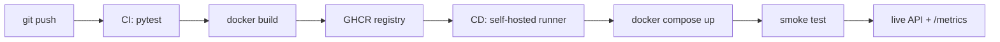

# Cats vs Dogs — End-to-End MLOps Pipeline

MLOps (S1-25_AIMLCZG523) Assignment 2 · Student ID **2024AD05132**

Binary image classification (cat vs dog) served as a containerized REST API, with
experiment tracking, data versioning, CI/CD and post-deployment monitoring.

---

## Architecture



## Layout

| Path | Purpose |
| --- | --- |
| `src/data.py` | Preprocessing (224x224 RGB), augmentation, 80/10/10 split |
| `src/model.py` | `SimpleCNN` baseline, save/load, prediction helper |
| `src/train.py` | Training loop with MLflow logging |
| `src/api.py` | FastAPI service: `/health`, `/predict`, `/metrics` |
| `tests/` | Unit tests for preprocessing and inference |
| `scripts/` | Dataset download, smoke test, post-deploy replay |
| `.github/workflows/` | `ci.yml` (test + build + push), `cd.yml` (deploy + smoke) |
| `monitoring/` | Prometheus scrape config |

## Quick start

```powershell
python -m venv .venv
.\.venv\Scripts\Activate.ps1
pip install --extra-index-url https://download.pytorch.org/whl/cpu -r requirements-dev.txt
```

### M1 — Train and track

```powershell
python scripts/download_data.py          # populates data/raw/{cat,dog}
dvc init; dvc remote add -d localstore D:\dvcstore
dvc add data/raw; git add data/raw.dvc .gitignore; git commit -m "Track dataset with DVC"

python -m src.train --run-name simple-cnn
mlflow ui                                 # http://localhost:5000
```

### M2 — Serve and containerize

```powershell
uvicorn src.api:app --reload              # http://localhost:8000/docs

docker build -t catdog-api:local .
docker run --rm -p 8000:8000 catdog-api:local
curl.exe -F "file=@data/raw/dog/1.jpg" http://localhost:8000/predict
```

### M3 — Tests and CI

```powershell
pytest -v
```

CI runs on every push/PR: installs dependencies, runs pytest, builds the image and
pushes `latest` plus a commit-SHA tag to GHCR.

### M4 — Deploy

```powershell
$env:IMAGE = "ghcr.io/<owner>/<repo>:latest"
docker compose up -d
python scripts/smoke_test.py --base-url http://localhost:8000
```

CD triggers on a successful CI run on `main` and executes on a **self-hosted runner**,
so it can reach the local Docker host without any inbound firewall rule. A failed smoke
test fails the pipeline and tears the deployment down.

### M5 — Monitor

```powershell
curl.exe http://localhost:8000/metrics    # Prometheus exposition
python scripts/replay_batch.py --limit 50 # -> reports/post_deploy_metrics.json
```

Prometheus UI at `http://localhost:9090` when running via Compose.

## API

| Method | Path | Description |
| --- | --- | --- |
| `GET` | `/health` | Liveness, model-loaded flag, requests served |
| `POST` | `/predict` | Multipart image upload → label + class probabilities |
| `GET` | `/metrics` | Prometheus metrics (request count, latency histogram) |
| `GET` | `/docs` | OpenAPI UI |

```json
{
  "label": "dog",
  "probabilities": { "cat": 0.0421, "dog": 0.9579 },
  "latency_ms": 38.6,
  "request_id": "5f0c1c2e-..."
}
```

## Configuration

All hyperparameters live in `params.yaml`. Runtime overrides:

| Variable | Default | Purpose |
| --- | --- | --- |
| `MODEL_PATH` | `models/model.pt` | Checkpoint location |
| `MAX_UPLOAD_BYTES` | `10485760` | Upload size cap |
| `IMAGE` | `ghcr.io/OWNER/catdog-api:latest` | Image used by Compose |

## Notes

- Requests are logged as structured JSON with metadata only — image bytes are never logged.
- The container runs as a non-root user and declares a `HEALTHCHECK`.
- All ML dependencies are version-pinned for reproducibility.
