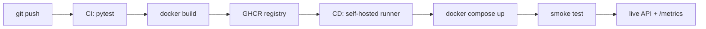

# Cats vs Dogs — End-to-End MLOps Pipeline

MLOps (S1-25_AIMLCZG523) Assignment 2 · Student ID **2024AD05132**

Binary image classification (cat vs dog) served as a containerized REST API, with
experiment tracking, data versioning, CI/CD and post-deployment monitoring.

---

# READ THIS FIRST — INSTRUCTIONS FOR THE AI AGENT

You are continuing a part-finished university assignment. Tasks 1–7 are **already done
and verified**. Your job is Tasks 8–14.

## Rules you must follow

1. **Work through tasks in numerical order.** Do not skip ahead.
2. **Run exactly one task at a time.** Finish it before starting the next.
3. **After finishing a task, edit the Status Board below** and change that row's
   `TODO` to `DONE`. This is how you and the user know where things stand.
4. **If a command's output does not match "EXPECTED", stop.** Read the "IF IT FAILS"
   note for that task. Do not continue to the next task until it matches.
5. **Tasks marked `[NEEDS HUMAN]` cannot be done by you.** Stop, tell the user exactly
   what to do, and wait for them to confirm.
6. **Never invent a GitHub username or repository name.** Ask the user for it.
7. **Do not modify files in `src/`, `tests/` or `.github/`** unless a task says to.
   The code is working and verified.

## Status Board — keep this updated

| # | Task | State | Who |
| --- | --- | --- | --- |
| 1 | Project scaffold, all source code | DONE | — |
| 2 | Unit tests (13 tests) | DONE — 13 passed | — |
| 3 | Git repo + 8 commits | DONE | — |
| 4 | DVC init, dataset tracked + pushed | DONE — 24,998 files | — |
| 5 | Dataset downloaded | DONE — 12,499 cat / 12,499 dog | — |
| 6 | Model trained → `models/model.pt` | DONE — 70.2% test accuracy | — |
| 7 | API verified with uvicorn | DONE — predictions served | — |
| 8 | Environment setup on this machine | **TODO** | Agent |
| 9 | Build the Docker image | **TODO** | Agent |
| 10 | Run container, verify prediction | **TODO** | Agent |
| 11 | Create GitHub repo + push | **TODO** | `[NEEDS HUMAN]` + Agent |
| 12 | Verify CI pipeline is green | **TODO** | Agent |
| 13 | Register self-hosted runner | **TODO** | `[NEEDS HUMAN]` |
| 14 | Verify CD deploys + smoke test | **TODO** | Agent |
| 15 | Record the demo video | **TODO** | `[NEEDS HUMAN]` |
| 16 | Build the submission zip | **TODO** | Agent |

---

## TASK 8 — Set up the environment

**Objective:** get a working Python environment and confirm Docker is available.

**Step 8.1 — Delete the copied virtual environment.** It came from another machine and
contains hardcoded paths that will not work here.

```powershell
# Windows PowerShell
Remove-Item -Recurse -Force .venv -ErrorAction SilentlyContinue
```
```bash
# Linux / macOS
rm -rf .venv
```

**Step 8.2 — Create a fresh environment and install dependencies.**

```powershell
# Windows PowerShell
python -m venv .venv
.\.venv\Scripts\python.exe -m pip install --upgrade pip
.\.venv\Scripts\python.exe -m pip install --extra-index-url https://download.pytorch.org/whl/cpu -r requirements-dev.txt
```
```bash
# Linux / macOS
python3 -m venv .venv
./.venv/bin/pip install --upgrade pip
./.venv/bin/pip install --extra-index-url https://download.pytorch.org/whl/cpu -r requirements-dev.txt
```

This downloads about 250 MB and takes several minutes. Wait for it to finish.

**Step 8.3 — Verify.**

```powershell
.\.venv\Scripts\python.exe -m pytest -q          # Windows
./.venv/bin/python -m pytest -q                  # Linux/macOS
docker --version
docker run --rm hello-world
```

**EXPECTED:**
- pytest prints `13 passed`
- `docker --version` prints a version number
- `hello-world` prints "Hello from Docker!"

**IF IT FAILS:**
- `docker: command not found` → Docker is not installed. `[NEEDS HUMAN]` Ask the user
  to install Docker Desktop, or Docker Engine on Linux.
- `Cannot connect to the Docker daemon` → the daemon is not running. `[NEEDS HUMAN]`
  Ask the user to start Docker Desktop, or run `sudo service docker start`.
- pytest reports fewer than 13 tests → you are in the wrong directory. `cd` to the
  folder containing `params.yaml`.

**WHEN DONE:** set row 8 to `DONE`.

---

## TASK 9 — Build the Docker image

**Objective:** package the API and model into a container image.

```bash
docker build -t catdog-api:local .
docker images catdog-api
```

The first build takes 5–10 minutes because it downloads PyTorch.

**EXPECTED:** the build ends with `naming to docker.io/library/catdog-api:local`, and
`docker images` lists `catdog-api` with tag `local`, size roughly 1.5–2.5 GB.

**IF IT FAILS:**
- `COPY models/ ./models/: not found` → run the build from the project root, the folder
  containing `Dockerfile`.
- Network or TLS errors during `pip install` → retry. If it persists, the machine is
  behind a proxy. `[NEEDS HUMAN]` Ask the user for proxy settings.

**WHEN DONE:** set row 9 to `DONE`.

---

## TASK 10 — Run the container and verify a prediction

**Objective:** prove the containerized model actually serves predictions. This is an
explicit assignment requirement (M2).

**Step 10.1 — Start the container.**

```bash
docker run -d -p 8000:8000 --name catdog catdog-api:local
```

Wait 15 seconds for the model to load, then:

```bash
curl http://localhost:8000/health
```

**EXPECTED:** `{"status":"ok","model_loaded":true,"requests_served":0}`

**`model_loaded` MUST be `true`.** If it is `false`, stop — `models/model.pt` is missing
or empty. Check with `ls -l models/model.pt`; it should be about 0.93 MB. Fix, then
rebuild from Task 9.

**Step 10.2 — Make real predictions.**

```bash
curl -F "file=@samples/dog_10.jpg" http://localhost:8000/predict
curl -F "file=@samples/cat_10.jpg" http://localhost:8000/predict
```

**EXPECTED** — a JSON object with these four keys:
```json
{"label":"dog","probabilities":{"cat":0.31,"dog":0.69},"latency_ms":38.6,"request_id":"..."}
```

The `label` may be wrong on some images. **That is acceptable** — the baseline model is
about 70% accurate. What matters is that a valid response comes back.

**Step 10.3 — Check monitoring, then stop the container.**

```bash
curl http://localhost:8000/metrics
docker logs catdog
docker stop catdog && docker rm catdog
```

**EXPECTED:** `/metrics` returns Prometheus text including `http_requests_total`.
`docker logs` shows JSON lines with `"event": "prediction"`.

**WHEN DONE:** set row 10 to `DONE`.

---

## TASK 11 — Create a GitHub repository and push

**`[NEEDS HUMAN]` first.** Stop and ask the user to:

1. Go to `https://github.com/new`
2. Create a **public** repository (public keeps GitHub Actions free)
3. Do **not** add a README, .gitignore or licence — the repo must be empty
4. Tell you the resulting URL

**Then, once they give you the URL**, run:

```bash
git config user.name "THEIR NAME"
git config user.email "THEIR EMAIL"
git remote add origin https://github.com/<USERNAME>/<REPO>.git
git branch -M main
git push -u origin main
```

Ask the user for their name and email. The build machine used a placeholder identity.

**EXPECTED:** `git push` reports `branch 'main' set up to track 'origin/main'`.

**IF IT FAILS:**
- `remote origin already exists` → run `git remote set-url origin <URL>` instead.
- Authentication failed → `[NEEDS HUMAN]` The user must sign in. Suggest GitHub CLI
  (`gh auth login`) or a Personal Access Token.

**WHEN DONE:** set row 11 to `DONE` and record the repo URL here: `________`

---

## TASK 12 — Verify the CI pipeline

**Objective:** confirm tests run and the image is published automatically.

Ask the user to open `https://github.com/<USERNAME>/<REPO>/actions`. The **CI** workflow
starts by itself after the push.

**EXPECTED:** two jobs, `test` then `build-and-push`, both green. The image then appears
under the repository's **Packages** section.

CI takes 5–8 minutes. Wait; do not re-run it.

**IF IT FAILS:**
- `denied: permission_denied` or `403` in `build-and-push` → `[NEEDS HUMAN]` Ask the
  user to open `Settings → Actions → General → Workflow permissions`, select
  **Read and write permissions**, save, then re-run the failed job.
- The `test` job fails → read the log. The same tests pass locally, so this is usually a
  dependency issue. Report the exact error to the user.

**Also ask the user to make the package public** so it can be pulled without a login:
`Packages → <package> → Package settings → Change visibility → Public`.

**WHEN DONE:** set row 12 to `DONE`.

---

## TASK 13 — Register the self-hosted runner

**`[NEEDS HUMAN]` — you cannot do this step.** It requires a one-time token from the
GitHub UI.

Explain to the user: *GitHub's servers cannot reach this machine through the firewall.
A self-hosted runner solves that by connecting outward to GitHub and waiting for jobs.
Without it, the CD pipeline cannot deploy here.*

Ask them to:

1. Open `Settings → Actions → Runners → New self-hosted runner`
2. Pick their operating system
3. Run the commands GitHub displays — download, then `config.cmd` / `config.sh`,
   accepting the defaults
4. Start it: `run.cmd` / `./run.sh`, or install as a service with `./svc.sh install && ./svc.sh start`
5. Confirm the runner shows **Idle** in the Runners list

**WHEN DONE:** set row 13 to `DONE`.

---

## TASK 14 — Verify CD deployment and the smoke test

**Objective:** prove the pipeline deploys automatically and blocks bad releases.

**Step 14.1 — Deploy manually once, to confirm Compose works.**

```powershell
# Windows PowerShell
$env:IMAGE = "ghcr.io/<USERNAME>/<REPO>:latest"
docker compose pull
docker compose up -d
.\.venv\Scripts\python.exe scripts\smoke_test.py --base-url http://localhost:8000
```
```bash
# Linux / macOS
export IMAGE=ghcr.io/<USERNAME>/<REPO>:latest
docker compose pull
docker compose up -d
./.venv/bin/python scripts/smoke_test.py --base-url http://localhost:8000
```

**EXPECTED:** last line reads `[PASS] smoke test succeeded`

**Step 14.2 — Now prove it happens automatically.**

```bash
git commit --allow-empty -m "Trigger CI/CD pipeline"
git push
```

Watch the Actions tab. **CI** runs first, then **CD** starts on the self-hosted runner,
pulls the new image, redeploys, and runs the smoke test.

**EXPECTED:** both workflows green, and `docker compose ps` shows a running container.

**Step 14.3 — Prove the smoke test can fail the pipeline.** The assignment requires
this. In `src/api.py`, find the `/health` handler and temporarily change `status="ok"`
to `status="broken"`, then:

```bash
git add src/api.py && git commit -m "Temporarily break health check" && git push
```

**EXPECTED:** CD fails at the smoke-test step and the deployment is torn down.

**Then revert immediately:**

```bash
git revert --no-edit HEAD
git push
```

Confirm CD goes green again before continuing.

**WHEN DONE:** set row 14 to `DONE`.

---

## TASK 15 — Record the demo video

**`[NEEDS HUMAN]` — you cannot record a screen.** Give the user this guidance.

**Recording tool:** OBS Studio (free, `obsproject.com`). Add a *Display Capture* source
and press Start Recording. Avoid Xbox Game Bar — it refuses to capture File Explorer
and the desktop, which this demo needs.

**The timing trap:** CI takes 5–8 minutes, but the video must be under 5 minutes. Do not
sit watching a spinner. Push first, then narrate other material while CI runs.

| Time | Show |
| --- | --- |
| 0:00 | Edit one line in `src/api.py`, commit, **push** — starts CI running |
| 0:30 | While CI runs: `mlflow ui` at :5000 — params, metrics, confusion matrix, loss curves |
| 1:30 | While CI runs: `data/raw.dvc` and `dvc status` — dataset versioning |
| 2:00 | While CI runs: walk through `Dockerfile` and the two workflow files |
| 2:45 | Back to Actions — CI now green, image pushed to GHCR |
| 3:00 | CD starts automatically on the self-hosted runner |
| 3:30 | Smoke test passes; `docker compose ps` shows the new container |
| 4:00 | `curl` a live prediction against the deployed service |
| 4:30 | `/metrics` and `docker logs` — monitoring |

**Before recording:** rehearse once, set the terminal font to about 16pt, enable Windows
Focus Assist to suppress notifications, pre-open the Actions and Packages tabs, and close
email and chat apps.

**Two details that earn marks:** show the smoke-test failure path from Task 14.3, and
point out that the running image tag matches the commit SHA — that is traceability from
code to deployment.

**WHEN DONE:** set row 15 to `DONE`.

---

## TASK 16 — Build the submission zip

**Objective:** produce the final deliverable.

```powershell
# Windows PowerShell — run from the project root
$stage = "submission_2024AD05132"
Remove-Item -Recurse -Force $stage, "$stage.zip" -ErrorAction SilentlyContinue
New-Item -ItemType Directory -Force -Path $stage | Out-Null
foreach ($i in 'src','tests','scripts','samples','monitoring','models','reports','.github','.dvc','Dockerfile','docker-compose.yml','requirements.txt','requirements-dev.txt','params.yaml','pytest.ini','.dockerignore','.dvcignore','.gitignore','README.md','data') {
  if (Test-Path $i) { Copy-Item $i -Destination $stage -Recurse -Force }
}
Remove-Item -Recurse -Force "$stage\.dvc\cache","$stage\data\raw" -ErrorAction SilentlyContinue
Copy-Item mlruns -Destination $stage -Recurse -Force -ErrorAction SilentlyContinue
Compress-Archive -Path "$stage\*" -DestinationPath "$stage.zip" -Force
Remove-Item -Recurse -Force $stage
"zip size: $([math]::Round((Get-Item "$stage.zip").Length/1MB,2)) MB"
```

**EXPECTED:** a zip of roughly 5–20 MB.

**Verify it contains** all of: `src/`, `tests/`, `scripts/`, `.github/workflows/`,
`Dockerfile`, `docker-compose.yml`, `.dvc/config`, `data/raw.dvc`, `models/model.pt`,
`reports/confusion_matrix.png`, `reports/training_curves.png`, `requirements.txt`.

**It must NOT contain** `.venv/`, `data/raw/` or `.dvc/cache/`. If the zip is larger
than 100 MB, one of those slipped in.

Submit the zip together with the video from Task 15.

**WHEN DONE:** set row 16 to `DONE` and tell the user the assignment is complete.

---

## Reference — results already verified on the build machine

| Check | Result |
| --- | --- |
| `pytest -v` | 13 passed |
| Training (5 epochs, 5,000 images) | test accuracy **0.7020**, test loss 0.5709 |
| `models/model.pt` | 0.93 MB |
| MLflow run `simple-cnn-baseline` | params, metrics, confusion matrix, loss curves |
| `GET /health` | `{"status":"ok","model_loaded":true,"requests_served":0}` |
| `POST /predict` | label + probabilities, 24–85 ms |
| `GET /metrics` | Prometheus counters increment per request |
| `scripts/replay_batch.py --limit 50` | accuracy 0.68, mean latency 27.4 ms |

About 70% accuracy is expected and fine. The assignment asks for a *baseline* CNN
trained from scratch, and no marks depend on accuracy.

## Reference — notes about the copied folder

- `data/raw/` (810 MB) and `.dvc/cache/` (848 MB) may have come across with the folder.
  They are not needed for Tasks 8–16, and must be excluded from the submission zip.
- `dvc pull` will **not** work here: the DVC remote in `.dvc/config` points at a folder
  on the original build machine. This does not matter — the dataset is either already
  present or unnecessary.
- Six demo images are in `samples/`, so predictions can be tested without the dataset.
- `models/model.pt` is committed to Git, so the Docker build has a real model.


---
---

# Project reference

## Architecture




## Layout

| Path | Purpose |
| --- | --- |
| `src/data.py` | Preprocessing (224x224 RGB), augmentation, 80/10/10 split |
| `src/model.py` | `SimpleCNN` baseline, save/load, prediction helper |
| `src/train.py` | Training loop with MLflow logging |
| `src/api.py` | FastAPI service: `/health`, `/predict`, `/metrics` |
| `tests/` | Unit tests for preprocessing and inference |
| `scripts/` | Dataset download, smoke test, post-deploy replay |
| `.github/workflows/` | `ci.yml` (test + build + push), `cd.yml` (deploy + smoke) |
| `monitoring/` | Prometheus scrape config |

## Quick start

```powershell
python -m venv .venv
.\.venv\Scripts\Activate.ps1
pip install --extra-index-url https://download.pytorch.org/whl/cpu -r requirements-dev.txt
```

### M1 — Train and track

```powershell
python scripts/download_data.py          # populates data/raw/{cat,dog}
dvc init; dvc remote add -d localstore D:\dvcstore
dvc add data/raw; git add data/raw.dvc .gitignore; git commit -m "Track dataset with DVC"

python -m src.train --run-name simple-cnn
mlflow ui                                 # http://localhost:5000
```

### M2 — Serve and containerize

```powershell
uvicorn src.api:app --reload              # http://localhost:8000/docs

docker build -t catdog-api:local .
docker run --rm -p 8000:8000 catdog-api:local
curl.exe -F "file=@data/raw/dog/1.jpg" http://localhost:8000/predict
```

### M3 — Tests and CI

```powershell
pytest -v
```

CI runs on every push/PR: installs dependencies, runs pytest, builds the image and
pushes `latest` plus a commit-SHA tag to GHCR.

### M4 — Deploy

```powershell
$env:IMAGE = "ghcr.io/<owner>/<repo>:latest"
docker compose up -d
python scripts/smoke_test.py --base-url http://localhost:8000
```

CD triggers on a successful CI run on `main` and executes on a **self-hosted runner**,
so it can reach the local Docker host without any inbound firewall rule. A failed smoke
test fails the pipeline and tears the deployment down.

### M5 — Monitor

```powershell
curl.exe http://localhost:8000/metrics    # Prometheus exposition
python scripts/replay_batch.py --limit 50 # -> reports/post_deploy_metrics.json
```

Prometheus UI at `http://localhost:9090` when running via Compose.

## API

| Method | Path | Description |
| --- | --- | --- |
| `GET` | `/health` | Liveness, model-loaded flag, requests served |
| `POST` | `/predict` | Multipart image upload → label + class probabilities |
| `GET` | `/metrics` | Prometheus metrics (request count, latency histogram) |
| `GET` | `/docs` | OpenAPI UI |

```json
{
  "label": "dog",
  "probabilities": { "cat": 0.0421, "dog": 0.9579 },
  "latency_ms": 38.6,
  "request_id": "5f0c1c2e-..."
}
```

## Configuration

All hyperparameters live in `params.yaml`. Runtime overrides:

| Variable | Default | Purpose |
| --- | --- | --- |
| `MODEL_PATH` | `models/model.pt` | Checkpoint location |
| `MAX_UPLOAD_BYTES` | `10485760` | Upload size cap |
| `IMAGE` | `ghcr.io/OWNER/catdog-api:latest` | Image used by Compose |

## Notes

- Requests are logged as structured JSON with metadata only — image bytes are never logged.
- The container runs as a non-root user and declares a `HEALTHCHECK`.
- All ML dependencies are version-pinned for reproducibility.
