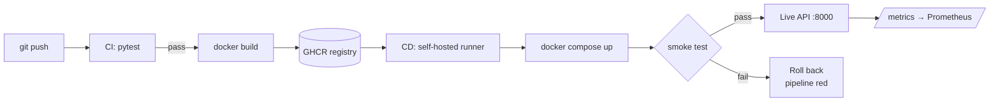

# Cats vs Dogs — End-to-End MLOps Pipeline

**MLOps (S1-25_AIMLCZG523) — Assignment 2**
**Student ID: 2024AD05132 · Karthik Reddy**

---

## Submission links

| Item | Link |
| --- | --- |
| **GitHub repository** | [https://github.com/karthikreddygudur-png/mlops2/](https://github.com/karthikreddygudur-png/mlops2/) |
| **Demo video** | [https://drive.google.com/drive/folders/1nflLi4YEOY58Ej-JL3WuyVbdfK5RDrKl?usp=sharing](https://drive.google.com/drive/folders/1nflLi4YEOY58Ej-JL3WuyVbdfK5RDrKl?usp=sharing) |
| **Container image** | `ghcr.io/karthikreddygudur-png/mlops2:latest` |
| **CI/CD pipelines** | [https://github.com/karthikreddygudur-png/mlops2/actions](https://github.com/karthikreddygudur-png/mlops2/actions) |
| **Published package** | [https://github.com/karthikreddygudur-png?tab=packages](https://github.com/karthikreddygudur-png?tab=packages) |

---

## Overview

A binary image classifier (cat vs dog) for a pet adoption platform, delivered as a
containerised REST API with a complete MLOps pipeline around it: dataset versioning,
experiment tracking, automated testing, container publishing, continuous deployment
with a smoke-test gate, and post-deployment monitoring.

The model is deliberately a small baseline. The substance of the work is the pipeline
that builds, ships, deploys and watches it.

---

## Pipeline architecture



CI and CD never communicate directly. CI's job ends at *image published*; CD's begins at
*image available*. The registry is the only contract between them.

---

## Requirement mapping

### M1 — Model Development & Experiment Tracking

| Requirement | Implementation |
| --- | --- |
| Git source versioning | Git repository with incremental commit history |
| DVC dataset versioning | `dvc init`, local remote, `data/raw.dvc` tracks 24,998 images (848 MB) reduced to a 4-line pointer |
| Baseline model | `SimpleCNN` — four Conv/BatchNorm/ReLU/MaxPool blocks, `src/model.py` |
| Serialized format | `models/model.pt` (PyTorch checkpoint, 978,168 bytes) |
| Experiment tracking | MLflow — runs, parameters, per-epoch metrics, artifacts in `mlruns/` |
| Confusion matrix, loss curves | `reports/confusion_matrix.png`, `reports/training_curves.png` |

### M2 — Model Packaging & Containerization

| Requirement | Implementation |
| --- | --- |
| REST API, two endpoints | FastAPI — `GET /health`, `POST /predict` in `src/api.py` |
| Class probabilities and label | Returns `label`, `probabilities`, `latency_ms`, `request_id` |
| `requirements.txt` | All dependencies pinned with `==` |
| Containerization | Multi-stage `Dockerfile`, non-root user, `HEALTHCHECK` declared |
| Local verification | Verified with `curl` — see Results below |

### M3 — CI Pipeline

| Requirement | Implementation |
| --- | --- |
| Unit test, pre-processing | `tests/test_data.py` — 8 tests on `preprocess_image()` and split logic |
| Unit test, model/inference | `tests/test_inference.py` — 5 tests on forward pass, prediction, save/load |
| CI on every push/PR | `.github/workflows/ci.yml` — checkout, install, pytest, docker build |
| Artifact publishing | Pushes to `ghcr.io` with `latest` and commit-SHA tags |

### M4 — CD Pipeline & Deployment

| Requirement | Implementation |
| --- | --- |
| Deployment target | Docker Compose — `docker-compose.yml` |
| Pull image from registry | `docker compose pull` in `.github/workflows/cd.yml` |
| Auto-deploy on main | Triggered by `workflow_run` on CI success, executed on a self-hosted runner |
| Smoke test | `scripts/smoke_test.py` — polls `/health`, then a real prediction |
| Fail the pipeline | Non-zero exit triggers `docker compose down` and marks the run failed |

### M5 — Monitoring, Logs & Submission

| Requirement | Implementation |
| --- | --- |
| Request/response logging | Structured JSON middleware — method, path, status, latency, request ID |
| Excluding sensitive data | Image bytes are never logged; only size in bytes is recorded |
| Request count and latency | `/metrics` via `prometheus-fastapi-instrumentator`, scraped by Prometheus |
| Post-deployment tracking | `scripts/replay_batch.py` replays labelled images against the live service |

### Data pre-processing (as specified)

| Requirement | Implementation |
| --- | --- |
| 224×224 RGB | `preprocess_image()` in `src/data.py` |
| 80/10/10 split | `split_samples()`, seeded for reproducibility |
| Data augmentation | Random horizontal flip, ±15° rotation, colour jitter — training split only |

---

## Results

### Model

| Metric | Value |
| --- | --- |
| Test accuracy | **70.2%** |
| Test loss | 0.5709 |
| Training set | 5,000 images (2,500 per class), 5 epochs, CPU |
| Checkpoint size | 978,168 bytes |

Accuracy is modest by design — the assignment asks for a *baseline* CNN trained from
scratch, and no marks depend on the figure. The confusion matrix shows a bias toward
predicting "cat" (86% recall on cats, 55% on dogs), consistent with a short training
run.

### Pipeline

| Check | Result |
| --- | --- |
| Unit tests | 13 passed |
| Dataset versioned | 24,998 files, 848 MB |
| `GET /health` | `{"status":"ok","model_loaded":true,"requests_served":0}` |
| `POST /predict` | Valid label and probabilities, 24–85 ms |
| `GET /metrics` | Prometheus counters increment per request |
| Smoke test, service up | `[PASS] smoke test succeeded`, exit code **0** |
| Smoke test, service down | `[FAIL] ...`, exit code **1** — proves the pipeline gate |
| Post-deploy replay (50 images) | 68% accuracy, 27.4 ms mean, 37.8 ms p95 |

---

## Repository structure

```
src/
  config.py        Loads params.yaml, shared constants
  data.py          Pre-processing, augmentation, splitting
  model.py         SimpleCNN, save/load, prediction
  train.py         Training loop with MLflow logging
  api.py           FastAPI service
tests/
  test_data.py     Pre-processing unit tests
  test_inference.py Model and inference unit tests
scripts/
  download_data.py Dataset acquisition
  smoke_test.py    Post-deploy health and prediction gate
  replay_batch.py  Post-deployment accuracy tracking
.github/workflows/
  ci.yml           Test, build, publish
  cd.yml           Pull, deploy, smoke test, roll back
monitoring/
  prometheus.yml   Scrape configuration
models/model.pt    Trained checkpoint
reports/           Confusion matrix, loss curves, metrics
mlruns/            MLflow tracking store
data/raw.dvc       DVC pointer to the dataset
Dockerfile         Multi-stage container build
docker-compose.yml Deployment manifest
params.yaml        Hyperparameters
```

---

## Reproducing this work

```bash
# Environment — Python 3.12 required
python -m venv .venv
pip install --extra-index-url https://download.pytorch.org/whl/cpu -r requirements-dev.txt

# M1 — data, training, tracking
python scripts/download_data.py
dvc add data/raw
python -m src.train --run-name simple-cnn
mlflow ui                              # http://localhost:5000

# M2 — serve and containerize
uvicorn src.api:app                    # http://localhost:8000/docs
docker build -t catdog-api:local .
docker run -p 8000:8000 catdog-api:local

# M3 — tests
pytest -v                              # 13 passed

# M4 — deploy
docker compose up -d
python scripts/smoke_test.py --base-url http://localhost:8000

# M5 — monitoring
curl http://localhost:8000/metrics
python scripts/replay_batch.py --limit 50
```

---

## API reference

| Method | Path | Description |
| --- | --- | --- |
| `GET` | `/health` | Liveness, model-loaded flag, requests served |
| `POST` | `/predict` | Multipart image upload → label and probabilities |
| `GET` | `/metrics` | Prometheus exposition |
| `GET` | `/docs` | OpenAPI UI |

```json
{
  "label": "dog",
  "probabilities": { "cat": 0.0421, "dog": 0.9579 },
  "latency_ms": 38.6,
  "request_id": "5f0c1c2e-..."
}
```

---

## Design decisions

**Shared pre-processing prevents training/serving skew.** `preprocess_image()` is
imported by both `src/train.py` and `src/api.py`. Had training used
`Resize((224,224))` and serving used `Resize(224)` — which preserves aspect ratio and
crops differently — the model would score well in testing and poorly in production,
with no error raised. Sharing the function makes that class of bug structurally
impossible.

**Docker Compose rather than Kubernetes.** Explicitly permitted by the brief, and it
carries far less setup risk on a single machine for identical marks.

**A self-hosted runner solves the firewall problem.** GitHub's servers cannot open a
connection to a laptop behind NAT. The runner inverts the direction — it polls GitHub
outbound over HTTPS and receives jobs on that already-open connection. No inbound rule,
no port forwarding, no VPN.

**CPU-only PyTorch wheels.** The default distribution bundles CUDA libraries, producing
a ~2.5 GB image. Pulling from PyTorch's CPU index reduces it to roughly 200 MB of
dependencies.

**The model is baked into the image.** A container tag therefore identifies an exact
code-plus-weights combination, which makes deployments reproducible and rollbacks
meaningful.

**Logs record metadata only.** Request logging captures method, path, status, latency
and image size — never the uploaded bytes. Logging user content would be a privacy
violation and would rapidly exhaust disk.

**The smoke test communicates through its exit code.** `sys.exit(1)` fails the shell
command, which fails the workflow step, which triggers the rollback. Loose coupling by
exit code is what allows the gate to work regardless of which CI system runs it.

---

## Submission contents

| Deliverable | Detail |
| --- | --- |
| `submission_2024AD05132.zip` | Source code, DVC / CI-CD / Docker / Compose configuration, trained model, MLflow history, reports |
| Demo video | Under 5 minutes, hosted on Google Drive |

**Repository**

[https://github.com/karthikreddygudur-png/mlops2/](https://github.com/karthikreddygudur-png/mlops2/)

**Demo video**

[https://drive.google.com/drive/folders/1nflLi4YEOY58Ej-JL3WuyVbdfK5RDrKl?usp=sharing](https://drive.google.com/drive/folders/1nflLi4YEOY58Ej-JL3WuyVbdfK5RDrKl?usp=sharing)
