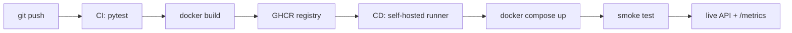

# Cats vs Dogs — End-to-End MLOps Pipeline

MLOps (S1-25_AIMLCZG523) Assignment 2 · Student ID **2024AD05132**

Binary image classification (cat vs dog) served as a containerized REST API, with
experiment tracking, data versioning, CI/CD and post-deployment monitoring.

---

# READ THIS FIRST — INSTRUCTIONS FOR THE AI AGENT

You are continuing a part-finished university assignment. Tasks 1–7 are **already done
and verified**. Your job is Tasks 8 to 17.

## Start here, every session

Before doing anything else:

1. Read the **Status Board** below.
2. Find the **first row that says `TODO`**.
3. Start at that task. Everything above it is already finished — do not redo it.
4. Tell the user which task you are starting.

This works whether it is your first session or you are resuming later.

## Rules you must follow

1. **Work through tasks in numerical order.** Do not skip ahead.
2. **Run exactly one task at a time.** Finish it before starting the next.
3. **After finishing a task, update the Status Board immediately.** Do not batch these
   up. See "How to update the Status Board" below for exactly how.
4. **If a command's output does not match "EXPECTED", stop.** Read the "IF IT FAILS"
   note for that task. Do not continue to the next task until it matches.
5. **Tasks marked `[NEEDS HUMAN]` cannot be done by you.** Stop, tell the user exactly
   what to do, and wait for them to confirm.
6. **Never invent a GitHub username or repository name.** Ask the user for it.
7. **Do not modify files in `src/`, `tests/` or `.github/`** unless a task says to.
   The code is working and verified.
7a. **Never change the pinned versions in `requirements.txt` or `requirements-dev.txt`.**
   The assignment is marked on reproducible version pinning. If an install fails, the
   cause is almost always the wrong Python version — see Task 8.0. Fix the interpreter,
   not the pins. If you believe a pin genuinely must change, stop and ask the user first.
8. **If you are stuck, stop and ask.** After two failed attempts at the same step, do
   not keep trying variations. Report to the user: which task, the exact command, the
   exact error, and what you already tried. Guessing makes things worse.
9. **Never ask the user to give you a password, token or secret.** If a command needs
   one, tell them to type it directly into the terminal themselves.

## How to update the Status Board

The Status Board is a table in **this file, `README.md`**. Edit it directly.

For example, after finishing Task 9, find this line:

```
| 9 | Build the Docker image | **TODO** | Agent |
```

and change it to:

```
| 9 | Build the Docker image | DONE | Agent |
```

Add a short result where it is useful, for example
`DONE — image 1.9 GB` or `DONE — CI green`.

If a task **failed** and you had to stop, mark it so the state is not lost:

```
| 9 | Build the Docker image | BLOCKED — see note below | Agent |
```

and write one line under the board explaining what blocked it.

Then commit the change so the progress is recorded:

```bash
git add README.md
git commit -m "Task 9 complete"
```

## Status Board — keep this updated

| # | Task | State | Who |
| --- | --- | --- | --- |
| 1 | Project scaffold, all source code | DONE | — |
| 2 | Unit tests (13 tests) | DONE — 13 passed | — |
| 3 | Git repo + local commit history | DONE — nothing pushed to a server yet | — |
| 4 | DVC init, dataset tracked + pushed | DONE — 24,998 files | — |
| 5 | Dataset downloaded | DONE — 12,499 cat / 12,499 dog | — |
| 6 | Model trained → `models/model.pt` | DONE — 70.2% test accuracy | — |
| 7 | API verified with uvicorn | DONE — predictions served | — |
| 8 | Environment setup on this machine | DONE | Agent |
| 8.5 | Preflight: Git + GitHub readiness | DONE | Agent |
| 8.6 | Preflight: Docker readiness | DONE | Agent |
| 9 | Build the Docker image | **TODO** | Agent |
| 10 | Run container, verify prediction | DONE — /health true; 2 predicts OK | Agent |
| 11 | Create GitHub repo + push (first push) | **TODO** | `[NEEDS HUMAN]` + Agent |
| 12 | Verify CI pipeline is green | **TODO** | Agent |
| 13 | Register self-hosted runner | **TODO** | `[NEEDS HUMAN]` |
| 14 | Verify CD deploys + smoke test | **TODO** | Agent |
| 15 | Record the demo video | **TODO** | `[NEEDS HUMAN]` |
| 16 | Build the submission zip | **TODO** | Agent |
| 17 | Hand over to user with submission summary | **TODO** | Agent |

---

Docker daemon verified running and `hello-world` ran successfully.

## What Tasks 1–7 already produced — do not redo these

Read this so you understand what exists. Every item below is finished and verified.

**Task 1 — Project scaffold.** All source code written and working:
`src/config.py` (loads `params.yaml`), `src/data.py` (preprocessing, augmentation,
80/10/10 split), `src/model.py` (`SimpleCNN`, save/load, predict), `src/train.py`
(training + MLflow), `src/api.py` (FastAPI service). Plus `Dockerfile`,
`docker-compose.yml`, both GitHub Actions workflows, and three scripts in `scripts/`.

**Task 2 — Unit tests.** 13 tests in `tests/test_data.py` (preprocessing shape, dtype,
grayscale handling, split correctness) and `tests/test_inference.py` (model forward,
probability validity, save/load round-trip). All pass. *Evidence:* run `pytest -q`.

**Task 3 — Git repository (local only).** `git init` was run and all work committed to
the `main` branch — 11 commits, 42 tracked files. The `.git/` folder travels with this
project folder, so **this machine already has the full history**. Do not run `git init`
again and do not re-commit existing files.

**Nothing has been pushed to any server yet.** There is no `origin` remote. Creating a
GitHub repository and pushing is Task 11. New commits you make here (for example in
Task 14) are committed locally and then pushed like normal.
*Evidence:* `git log --oneline` shows the history; `git remote -v` prints nothing.

**Task 4 — DVC data versioning.** `dvc init` done, a local remote configured, and the
dataset tracked. 24,998 files (848 MB) reduced to the 4-line pointer `data/raw.dvc`.
*Evidence:* `cat data/raw.dvc`, `cat .dvc/config`.

**Task 5 — Dataset.** 12,499 cat and 12,499 dog images downloaded and organized into
`data/raw/cat/` and `data/raw/dog/`. Six representative images copied to `samples/`
for demos.

**Task 6 — Model training.** `SimpleCNN` trained for 5 epochs on 5,000 images.
**Test accuracy 70.2%**, test loss 0.5709. Saved to `models/model.pt` (0.93 MB) and
logged to MLflow. *Evidence:* `reports/training_curves.png`,
`reports/confusion_matrix.png`, `reports/train_metrics.json`, and `mlflow ui`.

**Task 7 — API verification.** The service was run with uvicorn and confirmed working:
`/health` returned `model_loaded: true`, `/predict` returned real labels in 24–85 ms,
`/metrics` incremented Prometheus counters, and structured JSON request logs were
emitted. A 50-image replay scored 68% accuracy at 27 ms mean latency.
*Evidence:* `reports/post_deploy_metrics.json`.

**What this means for you:** the model, the data, the code and the tests all work.
If something fails in Tasks 8–16, the cause is almost certainly environment or
configuration on this machine — not the code. Do not rewrite `src/`.

---

## TASK 8 — Set up the environment

**Objective:** get a working Python environment.

**Step 8.0 — Check the Python version FIRST. This is the most common failure.**

```bash
python --version
```

**EXPECTED: Python 3.12.x**

This project is pinned to library versions that ship pre-built wheels for **Python
3.12**. It was built and fully verified on Python 3.12.10.

**IF THE VERSION IS NOT 3.12** (for example 3.13 or 3.14), **stop now.** Installation
will appear to work, then fail — pip cannot find wheels, falls back to compiling from
source, and you will see symptoms like:

```
Downloading numpy-2.1.3.tar.gz          <- a .tar.gz instead of a .whl means source build
ERROR: No matching distribution found for torchvision==0.20.1
```

**Do NOT fix this by editing `requirements.txt`.** The assignment (M2) explicitly
requires pinned versions for reproducibility, and changing them loses marks. It also
risks a version combination that has never been tested.

**The correct fix** — `[NEEDS HUMAN]` ask the user to install Python 3.12 from
`https://www.python.org/downloads/release/python-31210/`, then create the virtual
environment with that interpreter specifically:

```powershell
# Windows PowerShell — use the py launcher to pick 3.12 explicitly
py -3.12 -m venv .venv
.\.venv\Scripts\python.exe --version      # must print 3.12.x
```
```bash
# Linux / macOS
python3.12 -m venv .venv
./.venv/bin/python --version              # must print 3.12.x
```

If Python 3.12 genuinely cannot be installed, tell the user. Do not proceed by loosening
the pins without their explicit agreement.

**Step 8.1 — Delete the copied virtual environment.** It came from another machine and
contains hardcoded paths that will not work here.

```powershell
# Windows PowerShell
Remove-Item -Recurse -Force .venv -ErrorAction SilentlyContinue
```
```bash
# Linux / macOS
rm -rf .venv
```

**Step 8.2 — Create a fresh environment and install dependencies.**

Use the **Python 3.12** interpreter confirmed in Step 8.0.

```powershell
# Windows PowerShell
py -3.12 -m venv .venv
.\.venv\Scripts\python.exe -m pip install --upgrade pip
.\.venv\Scripts\python.exe -m pip install --extra-index-url https://download.pytorch.org/whl/cpu -r requirements-dev.txt
```
```bash
# Linux / macOS
python3.12 -m venv .venv
./.venv/bin/pip install --upgrade pip
./.venv/bin/pip install --extra-index-url https://download.pytorch.org/whl/cpu -r requirements-dev.txt
```

The `--extra-index-url` is **required** — it is where the CPU-only torch wheels live.
Without it, pip either fails to find `torch==2.5.1` or downloads the much larger
CUDA build.

This downloads about 250 MB and takes several minutes. Wait for it to finish.

**HEALTHY SIGNS:** lines reading `Downloading torch-2.5.1+cpu-cp312-...whl` — a `.whl`
file, and `cp312` confirming Python 3.12.

**WARNING SIGNS — stop and re-check Step 8.0:**
- any `Downloading <package>.tar.gz` followed by "Building wheel" — that is a source
  build, meaning no matching wheel exists for this Python version
- `ERROR: No matching distribution found for ...`
- `error: Microsoft Visual C++ 14.0 or greater is required`

All three mean the Python version is wrong. Fix the interpreter, not the pins.

**Step 8.3 — Verify the Python environment.**

```powershell
.\.venv\Scripts\python.exe -m pytest -q          # Windows
```
```bash
./.venv/bin/python -m pytest -q                  # Linux/macOS
```

**EXPECTED:** pytest prints `13 passed`.

**IF IT FAILS:**
- Fewer than 13 tests collected, or `ModuleNotFoundError: src` → you are in the wrong
  directory. `cd` to the folder containing `params.yaml`.
- `No module named torch` → the install in Step 8.2 did not finish. Re-run it and wait
  for it to complete.

Docker is checked separately in Task 8.6.

**WHEN DONE:** set row 8 to `DONE`.

---

## TASK 8.5 — Preflight: Git and GitHub readiness

**Objective:** confirm Git works, credentials exist and GitHub is reachable — **before**
spending time on the Docker build. Do this now, not at Task 11.

**Step 8.5.1 — Check the local repository state.**

```bash
git --version
git log --oneline | head -3
git remote -v
git status --short
```

**EXPECTED:**
- a Git version number
- three commit lines (history came with the folder)
- `git remote -v` prints **nothing** — no remote yet, this is correct
- `git status --short` prints nothing, or only untracked files you did not create

**IF `git log` says `not a git repository`** → the `.git/` folder did not copy across.
`[NEEDS HUMAN]` Ask the user to re-copy the folder including hidden files, or to run
`git init` and accept that commit history is lost.

**Step 8.5.2 — Check the Git identity.**

```bash
git config user.name
git config user.email
```

**EXPECTED:** both print a value.

**IF EITHER IS EMPTY** → `[NEEDS HUMAN]` Ask the user for their name and email, then:

```bash
git config user.name "THEIR NAME"
git config user.email "THEIR EMAIL"
```

**Step 8.5.3 — Check GitHub is reachable.**

```bash
git ls-remote https://github.com/octocat/Hello-World.git HEAD
```

**EXPECTED:** one line ending in `HEAD`.

**IF IT FAILS:**
- `Could not resolve host` → no internet, or DNS is blocked.
- `SSL certificate problem` → the network intercepts TLS (common on corporate
  machines). `[NEEDS HUMAN]` Ask the user for the corporate CA certificate.
- Timeout → a proxy is required. `[NEEDS HUMAN]` Ask the user for proxy settings, then
  `git config --global http.proxy http://<proxy>:<port>`.

**Step 8.5.4 — Check stored credentials.**

```bash
git config --get credential.helper
gh auth status
```

`gh auth status` only works if GitHub CLI is installed; if the command is not found,
that is fine, ignore it.

**EXPECTED:** either `gh auth status` reports a logged-in account, or
`credential.helper` returns something like `manager`, `manager-core`, `store` or
`osxkeychain`.

**IF NEITHER** → the first push will prompt for credentials. That is acceptable, but
warn the user now so they are ready. The easiest path is `gh auth login`; otherwise they
need a Personal Access Token with `repo` and `write:packages` scopes, used in place of a
password.

**Step 8.5.5 — Collect the details needed for Task 11.**

Ask the user for these now and write them down here:

| Item | Value |
| --- | --- |
| GitHub username | `________` |
| Repository name | `________` |
| Git author name | `________` |
| Git author email | `________` |

**Do not guess or invent any of these.**

**WHEN DONE:** set row 8.5 to `DONE`.

---

## TASK 8.6 — Preflight: Docker readiness

**Objective:** confirm Docker can actually build and run *this* image. A version number
alone is not enough — several things can be installed yet still fail at Task 9.

Run each check and compare against EXPECTED before moving on.

**Step 8.6.1 — CLI and daemon.**

```bash
docker --version
docker info --format "{{.ServerVersion}}"
```

**EXPECTED:** a client version, and a server version. If the second command errors, the
CLI is installed but the **daemon is not running**.

**IF THE DAEMON IS NOT RUNNING** → `[NEEDS HUMAN]`:
- Windows/macOS: ask the user to start Docker Desktop and wait for "Engine running".
- Linux: ask them to run `sudo service docker start` or `sudo systemctl start docker`.
- WSL: ask them to run `sudo service docker start` inside the WSL distribution.

**Step 8.6.2 — Container platform must be Linux.**

```bash
docker info --format "{{.OSType}}"
```

**EXPECTED:** `linux`

**IF IT SAYS `windows`** → Docker Desktop is in Windows-container mode and **cannot
build this image**. `[NEEDS HUMAN]` Ask the user to right-click the Docker tray icon and
choose **"Switch to Linux containers"**.

**Step 8.6.3 — Compose v2 must be available.**

```bash
docker compose version
```

**EXPECTED:** version 2.x or later.

**IF `docker compose` IS NOT RECOGNISED** but `docker-compose` (with a hyphen) works,
you have the old v1. `docker-compose.yml` in this project has no `version:` key and
expects v2. `[NEEDS HUMAN]` Ask the user to install the Compose v2 plugin, or update
Docker Desktop.

**Step 8.6.4 — Can it pull and run an image?**

```bash
docker run --rm hello-world
```

**EXPECTED:** "Hello from Docker!"

**IF IT FAILS:**
- `permission denied ... /var/run/docker.sock` (Linux) → `[NEEDS HUMAN]` The user must
  run `sudo usermod -aG docker $USER`, then log out and back in.
- TLS or certificate errors → the network intercepts TLS. `[NEEDS HUMAN]` Ask the user
  for the corporate CA certificate and proxy settings.
- Timeout reaching `registry-1.docker.io` → a proxy is required. `[NEEDS HUMAN]`

**Step 8.6.5 — Enough free disk space.**

The image needs roughly **5 GB** during build (PyTorch plus build cache).

```powershell
# Windows PowerShell
[math]::Round((Get-PSDrive C).Free / 1GB, 1)
```
```bash
# Linux / macOS
df -h /var/lib/docker 2>/dev/null || df -h /
```

**EXPECTED:** at least 10 GB free, to be safe.

**IF LOW** → run `docker system prune -a -f` to reclaim space, then re-check. If still
low, `[NEEDS HUMAN]` tell the user how much is free and how much is needed.

**Step 8.6.6 — Port 8000 must be free.**

```powershell
# Windows PowerShell
Get-NetTCPConnection -LocalPort 8000 -ErrorAction SilentlyContinue
```
```bash
# Linux / macOS
ss -ltn 2>/dev/null | grep ':8000' || lsof -i :8000 || echo "port 8000 is free"
```

**EXPECTED:** nothing is listening on port 8000.

**IF SOMETHING IS USING IT** → stop that process, or note that you must change the port
mapping in `docker-compose.yml` and in every `curl` command from `8000` to a free port.

**Step 8.6.7 — Summary.**

Report to the user a short table of what passed:

| Check | Result |
| --- | --- |
| Docker CLI + daemon | |
| Linux containers | |
| Compose v2 | |
| Pull and run | |
| Disk space | |
| Port 8000 free | |

**Only proceed to Task 9 if every row passed.**

**WHEN DONE:** set row 8.6 to `DONE`.

---

## TASK 9 — Build the Docker image

**Objective:** package the API and model into a container image.

```bash
docker build -t catdog-api:local .
docker images catdog-api
```

The first build takes 5–10 minutes because it downloads PyTorch.

**EXPECTED:** the build ends with `naming to docker.io/library/catdog-api:local`, and
`docker images` lists `catdog-api` with tag `local`, size roughly 1.5–2.5 GB.

**IF IT FAILS:**
- `COPY models/ ./models/: not found` → run the build from the project root, the folder
  containing `Dockerfile`.
- Network or TLS errors during `pip install` → retry. If it persists, the machine is
  behind a proxy. `[NEEDS HUMAN]` Ask the user for proxy settings.

**WHEN DONE:** set row 9 to `DONE`.

---

## TASK 10 — Run the container and verify a prediction

**Objective:** prove the containerized model actually serves predictions. This is an
explicit assignment requirement (M2).

**Step 10.1 — Start the container.**

```bash
docker run -d -p 8000:8000 --name catdog catdog-api:local
```

Wait 15 seconds for the model to load, then:

```bash
curl http://localhost:8000/health
```

**EXPECTED:** `{"status":"ok","model_loaded":true,"requests_served":0}`

**`model_loaded` MUST be `true`.** If it is `false`, stop — `models/model.pt` is missing
or empty. Check with `ls -l models/model.pt`; it should be about 0.93 MB. Fix, then
rebuild from Task 9.

**Step 10.2 — Make real predictions.**

```bash
curl -F "file=@samples/dog_10.jpg" http://localhost:8000/predict
curl -F "file=@samples/cat_10.jpg" http://localhost:8000/predict
```

**EXPECTED** — a JSON object with these four keys:
```json
{"label":"dog","probabilities":{"cat":0.31,"dog":0.69},"latency_ms":38.6,"request_id":"..."}
```

The `label` may be wrong on some images. **That is acceptable** — the baseline model is
about 70% accurate. What matters is that a valid response comes back.

**Step 10.3 — Check monitoring, then stop the container.**

```bash
curl http://localhost:8000/metrics
docker logs catdog
docker stop catdog && docker rm catdog
```

**EXPECTED:** `/metrics` returns Prometheus text including `http_requests_total`.
`docker logs` shows JSON lines with `"event": "prediction"`.

**WHEN DONE:** set row 10 to `DONE`.

---

## TASK 11 — Create a GitHub repository and push

**Objective:** connect the existing local repository to a GitHub remote and push it.

The local Git history already exists (Task 3). You are **adding a remote**, not creating
a new repository. Do not run `git init`.

**Check the starting state first:**

```bash
git log --oneline | head -5     # should list existing commits
git remote -v                   # should print nothing
```

**`[NEEDS HUMAN]` — ask the user to:**

1. Go to `https://github.com/new`
2. Create a **public** repository (public keeps GitHub Actions free)
3. Do **not** add a README, .gitignore or licence — the repo must be completely empty
4. Give you the repository URL, plus their name and email for Git

**Then run:**

```bash
git config user.name "THEIR NAME"
git config user.email "THEIR EMAIL"
git remote add origin https://github.com/<USERNAME>/<REPO>.git
git branch -M main
```

**Now test before pushing anything.** These two checks catch a wrong URL or missing
credentials without changing anything:

```bash
git ls-remote origin
git push --dry-run origin main
```

**EXPECTED:**
- `git ls-remote origin` succeeds. On a brand-new empty repo it prints nothing, which
  is correct — what matters is that it does not error.
- `git push --dry-run` prints what *would* be pushed, ending with something like
  `* [new branch] main -> main`, and uploads nothing.

**IF EITHER FAILS, do not attempt the real push.** Fix the cause first — see the
failure list below.

**Only when both succeed, push for real:**

```bash
git push -u origin main
```

This uploads the entire existing history in one go.

**EXPECTED:** `git push` reports `branch 'main' set up to track 'origin/main'`, and the
files appear on GitHub.

**IF IT FAILS:**
- `remote origin already exists` → use `git remote set-url origin <URL>` instead.
- `Repository not found` → the URL is wrong, or the repo is private and unauthenticated.
- `Authentication failed` → `[NEEDS HUMAN]` The user must sign in. Suggest
  `gh auth login`, or a Personal Access Token as the password.
- `Updates were rejected` → the GitHub repo is not empty. Ask the user to delete and
  recreate it with no initial files.

**Note on commit identity:** the existing commits carry a placeholder author from the
build machine. That is harmless and does not affect marks. The `git config` commands
above apply the user's real identity to all **new** commits.

**WHEN DONE:** set row 11 to `DONE` and record the repo URL here: `________`

---

## TASK 12 — Verify the CI pipeline

**Objective:** confirm tests run and the image is published automatically.

**How to check the result.** You cannot see a browser. Use one of these:

*Option A — if GitHub CLI is installed (preferred, you can do this yourself):*

```bash
gh run list --limit 5
```

Repeat this every minute or two until the CI run shows `completed  success`.

*Option B — if `gh` is not installed:* `[NEEDS HUMAN]` Ask the user to open
`https://github.com/<USERNAME>/<REPO>/actions` and tell you whether both jobs are green.
Do not guess or assume the result.

CI takes 5–8 minutes. Wait; do not re-run it.

**EXPECTED:** two jobs, `test` then `build-and-push`, both green. The image then appears
under the repository's **Packages** section.

**To read a failure log yourself (if `gh` is available):**

```bash
gh run view --log-failed
```

**IF IT FAILS:**
- `denied: permission_denied` or `403` in `build-and-push` → `[NEEDS HUMAN]` Ask the
  user to open `Settings → Actions → General → Workflow permissions`, select
  **Read and write permissions**, save, then re-run the failed job.
- The `test` job fails → read the log. The same tests pass locally, so this is usually a
  dependency issue. Report the exact error to the user.

**Also ask the user to make the package public** so it can be pulled without a login:
`Packages → <package> → Package settings → Change visibility → Public`.

**WHEN DONE:** set row 12 to `DONE`.

---

## TASK 13 — Register the self-hosted runner

**`[NEEDS HUMAN]` — you cannot do this step.** It requires a one-time token from the
GitHub UI.

Explain to the user: *GitHub's servers cannot reach this machine through the firewall.
A self-hosted runner solves that by connecting outward to GitHub and waiting for jobs.
Without it, the CD pipeline cannot deploy here.*

Ask them to:

1. Open `Settings → Actions → Runners → New self-hosted runner`
2. Pick their operating system
3. Run the commands GitHub displays — download, then `config.cmd` / `config.sh`,
   accepting the defaults
4. Start it: `run.cmd` / `./run.sh`, or install as a service with `./svc.sh install && ./svc.sh start`
5. Confirm the runner shows **Idle** in the Runners list

**WHEN DONE:** set row 13 to `DONE`.

---

## TASK 14 — Verify CD deployment and the smoke test

**Objective:** prove the pipeline deploys automatically and blocks bad releases.

**Step 14.1 — Deploy manually once, to confirm Compose works.**

First log in to the container registry, otherwise the pull will fail:

```bash
docker login ghcr.io -u <USERNAME>
```

When prompted for a password, the user must paste a **Personal Access Token** with the
`read:packages` scope — not their GitHub password. `[NEEDS HUMAN]` Ask the user to type
it into the terminal themselves. **Never ask them to send you a token.**

If the package was made public in Task 12, `docker login` is not required and you can
skip it.

```powershell
# Windows PowerShell
$env:IMAGE = "ghcr.io/<USERNAME>/<REPO>:latest"
docker compose pull
docker compose up -d
Start-Sleep -Seconds 15
.\.venv\Scripts\python.exe scripts\smoke_test.py --base-url http://localhost:8000
```
```bash
# Linux / macOS
export IMAGE=ghcr.io/<USERNAME>/<REPO>:latest
docker compose pull
docker compose up -d
sleep 15
./.venv/bin/python scripts/smoke_test.py --base-url http://localhost:8000
```

**EXPECTED:** last line reads `[PASS] smoke test succeeded`

**IF `docker compose pull` FAILS** with `denied` or `manifest unknown` → the image is
private or was never published. Go back and confirm Task 12 finished, and that the
package visibility was set to Public.

**Step 14.2 — Now prove it happens automatically.**

```bash
git commit --allow-empty -m "Trigger CI/CD pipeline"
git push
```

**CI** runs first, then **CD** starts on the self-hosted runner, pulls the new image,
redeploys, and runs the smoke test.

**How to check:**

```bash
gh run list --limit 5        # if GitHub CLI is available
docker compose ps            # container should show as running
docker compose images        # confirms which image tag is deployed
```

If `gh` is unavailable, `[NEEDS HUMAN]` ask the user to check the Actions tab.

**EXPECTED:** both workflows green, and `docker compose ps` shows a running container.

**IF CD NEVER STARTS** → the self-hosted runner is offline. Go back to Task 13 and ask
the user to confirm the runner shows **Idle** in GitHub.

**Step 14.3 — Prove the smoke test can fail the pipeline.** The assignment explicitly
requires this.

Open `src/api.py` and find this block:

```python
@app.get("/health", response_model=HealthResponse, tags=["ops"])
async def health() -> HealthResponse:
    return HealthResponse(
        status="ok",
        model_loaded=STATE["model"] is not None,
        requests_served=int(STATE["requests"]),
    )
```

Change **exactly one line** — replace:

```python
        model_loaded=STATE["model"] is not None,
```

with:

```python
        model_loaded=False,
```

This makes `smoke_test.py` fail at its `model_loaded` check and return exit code 1,
which fails the pipeline. Do **not** change `status="ok"` instead — the smoke test only
inspects the HTTP status code and `model_loaded`, so changing the status text would
change nothing and the pipeline would stay green.

```bash
git add src/api.py
git commit -m "Temporarily break health check to prove smoke test gate"
git push
```

**EXPECTED:** CI passes, then **CD fails** at the `Smoke test` step, and the
`Roll back on failure` step runs `docker compose down`.

**Then revert immediately — do not leave the code broken:**

```bash
git revert --no-edit HEAD
git push
```

Confirm CD goes green again, and that `docker compose ps` shows the container running,
before moving on.

**WHEN DONE:** set row 14 to `DONE`.

---

## TASK 15 — Record the demo video

**`[NEEDS HUMAN]` — you cannot record a screen.** Give the user this guidance.

**Recording tool:** OBS Studio (free, `obsproject.com`). Add a *Display Capture* source
and press Start Recording. Avoid Xbox Game Bar — it refuses to capture File Explorer
and the desktop, which this demo needs.

**The timing trap:** CI takes 5–8 minutes, but the video must be under 5 minutes. Do not
sit watching a spinner. Push first, then narrate other material while CI runs.

| Time | Show |
| --- | --- |
| 0:00 | Edit one line in `src/api.py`, commit, **push** — starts CI running |
| 0:30 | While CI runs: `mlflow ui` at :5000 — params, metrics, confusion matrix, loss curves |
| 1:30 | While CI runs: `data/raw.dvc` and `dvc status` — dataset versioning |
| 2:00 | While CI runs: walk through `Dockerfile` and the two workflow files |
| 2:45 | Back to Actions — CI now green, image pushed to GHCR |
| 3:00 | CD starts automatically on the self-hosted runner |
| 3:30 | Smoke test passes; `docker compose ps` shows the new container |
| 4:00 | `curl` a live prediction against the deployed service |
| 4:30 | `/metrics` and `docker logs` — monitoring |

**Before recording:** rehearse once, set the terminal font to about 16pt, enable Windows
Focus Assist to suppress notifications, pre-open the Actions and Packages tabs, and close
email and chat apps.

**Two details that earn marks:** show the smoke-test failure path from Task 14.3, and
point out that the running image tag matches the commit SHA — that is traceability from
code to deployment.

**WHEN DONE:** set row 15 to `DONE`.

---

## TASK 16 — Build the submission zip

**Objective:** produce the final deliverable.

### What the assignment requires

The assignment (see `Assignment 2.md`, "Deliverables") asks for exactly two things:

**Deliverable 1 — a zip file containing:**

| Required | Files in this project |
| --- | --- |
| All source code | `src/`, `tests/`, `scripts/` |
| Config — DVC | `.dvc/config`, `.dvcignore`, `data/raw.dvc` |
| Config — CI/CD | `.github/workflows/ci.yml`, `.github/workflows/cd.yml` |
| Config — Docker | `Dockerfile`, `.dockerignore` |
| Config — deployment manifests | `docker-compose.yml`, `monitoring/prometheus.yml` |
| Trained model artifacts | `models/model.pt` |

Also include, as supporting evidence: `reports/confusion_matrix.png`,
`reports/training_curves.png`, `reports/train_metrics.json`,
`reports/post_deploy_metrics.json`, `mlruns/` (MLflow tracking store), `.git/`
(commit history proves the Git versioning requirement), `requirements.txt`,
`requirements-dev.txt`, `params.yaml`, `pytest.ini`, `samples/`, `README.md`.

**Deliverable 2 — the screen recording** from Task 15, under 5 minutes.

### Build the zip

```powershell
# Windows PowerShell — run from the project root
$stage = "submission_2024AD05132"
Remove-Item -Recurse -Force $stage, "$stage.zip" -ErrorAction SilentlyContinue
New-Item -ItemType Directory -Force -Path $stage | Out-Null
$items = 'src','tests','scripts','samples','monitoring','models','reports','mlruns',
         '.github','.dvc','.git','data','Dockerfile','docker-compose.yml',
         'requirements.txt','requirements-dev.txt','params.yaml','pytest.ini',
         '.dockerignore','.dvcignore','.gitignore','README.md','Assignment 2.md'
foreach ($i in $items) { if (Test-Path $i) { Copy-Item $i -Destination $stage -Recurse -Force } }
Remove-Item -Recurse -Force "$stage\.dvc\cache","$stage\data\raw" -ErrorAction SilentlyContinue
Compress-Archive -Path "$stage\*" -DestinationPath "$stage.zip" -Force
Remove-Item -Recurse -Force $stage
"zip size: $([math]::Round((Get-Item "$stage.zip").Length/1MB,2)) MB"
```

```bash
# Linux / macOS — run from the project root
zip -r submission_2024AD05132.zip . \
  -x ".venv/*" "data/raw/*" ".dvc/cache/*" "*.log" "__pycache__/*" \
     "*/__pycache__/*" ".pytest_cache/*"
du -h submission_2024AD05132.zip
```

**EXPECTED:** a zip of roughly 5–30 MB.

### Verify the zip before submitting

```powershell
# Windows PowerShell
Add-Type -AssemblyName System.IO.Compression.FileSystem
$z = [System.IO.Compression.ZipFile]::OpenRead((Resolve-Path "submission_2024AD05132.zip"))
'src/api.py','Dockerfile','docker-compose.yml','models/model.pt','data/raw.dvc',
'.github/workflows/ci.yml','.github/workflows/cd.yml','requirements.txt' | ForEach-Object {
  $n = $_; $hit = $z.Entries | Where-Object { $_.FullName -replace '\\','/' -like "*$n" }
  "{0,-40} {1}" -f $n, $(if ($hit) { "OK" } else { "MISSING" })
}
$z.Dispose()
```

```bash
# Linux / macOS
for f in src/api.py Dockerfile docker-compose.yml models/model.pt data/raw.dvc \
         .github/workflows/ci.yml .github/workflows/cd.yml requirements.txt; do
  unzip -l submission_2024AD05132.zip | grep -q "$f" && echo "OK      $f" || echo "MISSING $f"
done
```

Every line must read `OK`. If any reads `MISSING`, the zip is incomplete — fix and rebuild.

**The zip must NOT contain** `.venv/`, `data/raw/` or `.dvc/cache/`. If it exceeds
100 MB, one of those slipped in.

### Submit

Hand in both:
1. `submission_2024AD05132.zip`
2. The screen recording from Task 15 (under 5 minutes)

**WHEN DONE:** set row 16 to `DONE` and tell the user the assignment is complete.

---

## FINAL CHECK — all of this must be true before submitting

Go through the list. If any line is `NO`, the assignment is not finished.

| # | Check | How to confirm |
| --- | --- | --- |
| 1 | All status board rows say `DONE` | Read the board at the top |
| 2 | Unit tests pass | `pytest -q` → `13 passed` |
| 3 | Docker image builds | `docker images catdog-api` lists it |
| 4 | Container serves predictions | `curl .../predict` returns a label |
| 5 | Code is on GitHub | `git remote -v` shows origin; repo has files |
| 6 | CI workflow ran green | Actions tab, or `gh run list` |
| 7 | Image published to GHCR | Repository → Packages |
| 8 | Self-hosted runner registered | Settings → Actions → Runners shows Idle |
| 9 | CD deployed automatically | CD workflow green after a push |
| 10 | Smoke test passed in the pipeline | CD log shows `[PASS] smoke test succeeded` |
| 11 | Smoke test failure demonstrated | Task 14.3 produced a red CD run |
| 12 | `src/api.py` reverted after Task 14.3 | `git log` shows the revert; CD green again |
| 13 | Video recorded, under 5 minutes | Check the file duration |
| 14 | Submission zip built and verified | Task 16 verification printed all `OK` |

Only when every row is `YES`, tell the user the assignment is complete, and remind them
to submit **both** the zip and the video.

---

## TASK 17 — Hand over to the user

**Objective:** tell the user clearly what to submit. Do this last, after the FINAL CHECK
above is fully green.

Give the user this summary, filling in the real values:

> **Your MLOps Assignment 2 is complete. Submit these two items.**
>
> **1. Code and artifacts — `submission_2024AD05132.zip`**
> Location: `<full path to the zip>`
> Size: `<size>` MB
> Contains: all source code, DVC / CI-CD / Docker / Compose configuration, the trained
> model `models/model.pt`, MLflow run history, and the training and post-deployment reports.
>
> **2. Screen recording — `<video filename>`**
> Location: `<full path to the video>`
> Duration: `<mm:ss>` (must be under 5 minutes)
> Shows the full workflow from a code change through CI, image publication, automatic
> deployment, smoke test, and a live prediction.
>
> **Reference links for your submission notes:**
> - GitHub repository: `https://github.com/<USERNAME>/<REPO>`
> - Container image: `ghcr.io/<USERNAME>/<REPO>:latest`
>
> **Results achieved:**
> - Model test accuracy: 70.2% (baseline CNN, as the assignment specifies)
> - Unit tests: 13 passing
> - Dataset: 24,998 images, versioned with DVC
> - CI and CD pipelines: both verified green, and the smoke-test failure path was
>   demonstrated and reverted
>
> **Before you submit, please confirm:**
> - The video is under 5 minutes.
> - The zip opens and contains `models/model.pt`.
> - Your GitHub repository is public, or the grader has been granted access.

**Then also tell the user about anything that did not go to plan** — any task that
needed a workaround, and anything still outstanding. Do not claim success for a step
that did not actually pass.

**WHEN DONE:** set row 17 to `DONE`. The assignment is finished.

---

## Reference — results already verified on the build machine

| Check | Result |
| --- | --- |
| `pytest -v` | 13 passed |
| Training (5 epochs, 5,000 images) | test accuracy **0.7020**, test loss 0.5709 |
| `models/model.pt` | 0.93 MB |
| MLflow run `simple-cnn-baseline` | params, metrics, confusion matrix, loss curves |
| `GET /health` | `{"status":"ok","model_loaded":true,"requests_served":0}` |
| `POST /predict` | label + probabilities, 24–85 ms |
| `GET /metrics` | Prometheus counters increment per request |
| `scripts/replay_batch.py --limit 50` | accuracy 0.68, mean latency 27.4 ms |
| `scripts/smoke_test.py` (service up) | `[PASS] smoke test succeeded`, exit code **0** |
| `scripts/smoke_test.py` (service down) | `[FAIL] ...`, exit code **1** — proves the pipeline gate works |

About 70% accuracy is expected and fine. The assignment asks for a *baseline* CNN
trained from scratch, and no marks depend on accuracy.

## Reference — notes about the copied folder

- `data/raw/` (810 MB) and `.dvc/cache/` (848 MB) may have come across with the folder.
  They are not needed for Tasks 8–16, and must be excluded from the submission zip.
- `dvc pull` will **not** work here: the DVC remote in `.dvc/config` points at a folder
  on the original build machine. This does not matter — the dataset is either already
  present or unnecessary.
- Six demo images are in `samples/`, so predictions can be tested without the dataset.
- `models/model.pt` is committed to Git, so the Docker build has a real model.


---
---

# Project reference

## Architecture




## Layout

| Path | Purpose |
| --- | --- |
| `src/data.py` | Preprocessing (224x224 RGB), augmentation, 80/10/10 split |
| `src/model.py` | `SimpleCNN` baseline, save/load, prediction helper |
| `src/train.py` | Training loop with MLflow logging |
| `src/api.py` | FastAPI service: `/health`, `/predict`, `/metrics` |
| `tests/` | Unit tests for preprocessing and inference |
| `scripts/` | Dataset download, smoke test, post-deploy replay |
| `.github/workflows/` | `ci.yml` (test + build + push), `cd.yml` (deploy + smoke) |
| `monitoring/` | Prometheus scrape config |

## Assignment module mapping

How each requirement in `Assignment 2.md` is satisfied.

| Module | Requirement | Implementation |
| --- | --- | --- |
| **M1** | Git source versioning | Git repository with incremental commits |
| M1 | DVC dataset versioning | `dvc init`, local remote, `data/raw.dvc` tracks 24,998 images |
| M1 | Baseline model, serialized | `SimpleCNN` in `src/model.py` → `models/model.pt` |
| M1 | Experiment tracking | MLflow in `src/train.py`; runs, params, metrics in `mlruns/` |
| M1 | Confusion matrix + loss curves | `reports/confusion_matrix.png`, `reports/training_curves.png` |
| **M2** | REST API, ≥2 endpoints | `/health` and `/predict` in `src/api.py` (FastAPI) |
| M2 | `requirements.txt`, versions pinned | Every dependency pinned with `==` |
| M2 | Dockerfile + local verification | Multi-stage `Dockerfile`; Task 10 verifies via curl |
| **M3** | Unit test — preprocessing | `tests/test_data.py` (8 tests on `preprocess_image`, splits) |
| M3 | Unit test — model/inference | `tests/test_inference.py` (5 tests on forward, predict, round-trip) |
| M3 | CI on every push/PR | `.github/workflows/ci.yml` — checkout, install, pytest, build |
| M3 | Publish image to registry | Pushes to `ghcr.io` with `latest` and commit-SHA tags |
| **M4** | Deployment target + manifests | `docker-compose.yml` (Compose option) |
| M4 | CD pulls image, auto-deploys on main | `.github/workflows/cd.yml` on a self-hosted runner |
| M4 | Smoke test, fails the pipeline | `scripts/smoke_test.py`; non-zero exit triggers rollback |
| **M5** | Request/response logging | JSON middleware in `src/api.py`; metadata only, no image bytes |
| M5 | Request count + latency metrics | `/metrics` via `prometheus-fastapi-instrumentator` |
| M5 | Post-deployment performance | `scripts/replay_batch.py` → `reports/post_deploy_metrics.json` |

## Data pre-processing (as specified)

| Requirement | Where |
| --- | --- |
| 224x224 RGB | `preprocess_image()` in `src/data.py` |
| 80/10/10 train/val/test split | `split_samples()`, configured in `params.yaml` |
| Data augmentation | `build_train_transform()` — flip, rotation, colour jitter |

## Quick start

```powershell
python -m venv .venv
.\.venv\Scripts\Activate.ps1
pip install --extra-index-url https://download.pytorch.org/whl/cpu -r requirements-dev.txt
```

### M1 — Train and track

```powershell
python scripts/download_data.py          # populates data/raw/{cat,dog}
dvc init; dvc remote add -d localstore D:\dvcstore
dvc add data/raw; git add data/raw.dvc .gitignore; git commit -m "Track dataset with DVC"

python -m src.train --run-name simple-cnn
mlflow ui                                 # http://localhost:5000
```

### M2 — Serve and containerize

```powershell
uvicorn src.api:app --reload              # http://localhost:8000/docs

docker build -t catdog-api:local .
docker run --rm -p 8000:8000 catdog-api:local
curl.exe -F "file=@data/raw/dog/1.jpg" http://localhost:8000/predict
```

### M3 — Tests and CI

```powershell
pytest -v
```

CI runs on every push/PR: installs dependencies, runs pytest, builds the image and
pushes `latest` plus a commit-SHA tag to GHCR.

### M4 — Deploy

```powershell
$env:IMAGE = "ghcr.io/<owner>/<repo>:latest"
docker compose up -d
python scripts/smoke_test.py --base-url http://localhost:8000
```

CD triggers on a successful CI run on `main` and executes on a **self-hosted runner**,
so it can reach the local Docker host without any inbound firewall rule. A failed smoke
test fails the pipeline and tears the deployment down.

### M5 — Monitor

```powershell
curl.exe http://localhost:8000/metrics    # Prometheus exposition
python scripts/replay_batch.py --limit 50 # -> reports/post_deploy_metrics.json
```

Prometheus UI at `http://localhost:9090` when running via Compose.

## API

| Method | Path | Description |
| --- | --- | --- |
| `GET` | `/health` | Liveness, model-loaded flag, requests served |
| `POST` | `/predict` | Multipart image upload → label + class probabilities |
| `GET` | `/metrics` | Prometheus metrics (request count, latency histogram) |
| `GET` | `/docs` | OpenAPI UI |

```json
{
  "label": "dog",
  "probabilities": { "cat": 0.0421, "dog": 0.9579 },
  "latency_ms": 38.6,
  "request_id": "5f0c1c2e-..."
}
```

## Configuration

All hyperparameters live in `params.yaml`. Runtime overrides:

| Variable | Default | Purpose |
| --- | --- | --- |
| `MODEL_PATH` | `models/model.pt` | Checkpoint location |
| `MAX_UPLOAD_BYTES` | `10485760` | Upload size cap |
| `IMAGE` | `ghcr.io/OWNER/catdog-api:latest` | Image used by Compose |

## Notes

- Requests are logged as structured JSON with metadata only — image bytes are never logged.
- The container runs as a non-root user and declares a `HEALTHCHECK`.
- All ML dependencies are version-pinned for reproducibility.
