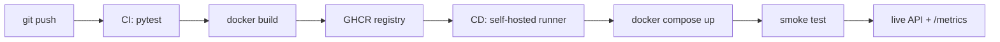

# Cats vs Dogs — End-to-End MLOps Pipeline

MLOps (S1-25_AIMLCZG523) Assignment 2 · Student ID **2024AD05132**

Binary image classification (cat vs dog) served as a containerized REST API, with
experiment tracking, data versioning, CI/CD and post-deployment monitoring.

---

# READ THIS FIRST — HANDOFF INSTRUCTIONS

**This project was built on a machine without Docker. Everything that does not need
Docker is already finished and verified. Your job is to complete the remaining tasks
below, in order.**

## Status board

| # | Task | State | Needs Docker |
| --- | --- | --- | --- |
| 1 | Project scaffold, all source code | DONE | No |
| 2 | Unit tests (13 tests) | DONE — all pass | No |
| 3 | Git repo + commits | DONE | No |
| 4 | DVC init + dataset tracked | DONE | No |
| 5 | Dataset downloaded (24,998 images) | DONE | No |
| 6 | Model trained to `models/model.pt` | DONE | No |
| 7 | API verified with uvicorn | DONE | No |
| 8 | Build the Docker image | **TODO** | Yes |
| 9 | Run container, verify prediction | **TODO** | Yes |
| 10 | Push to GitHub | **TODO** | No |
| 11 | Verify CI runs green | **TODO** | No |
| 12 | Register self-hosted runner | **TODO** | Yes |
| 13 | Verify CD deploys + smoke test | **TODO** | Yes |
| 14 | Record the demo video | **TODO** | Yes |

## Prerequisites on this machine

```bash
python -m venv .venv
# Windows PowerShell: .\.venv\Scripts\Activate.ps1
# Linux/macOS:        source .venv/bin/activate
pip install --extra-index-url https://download.pytorch.org/whl/cpu -r requirements-dev.txt
pytest -v          # expect: 13 passed
docker --version   # must succeed before Task 8
```

If `models/model.pt` did not come across with the project, regenerate it:

```bash
python scripts/download_data.py
python -m src.train --epochs 3 --subset-per-class 2000
```

## TASK 8 — Build the Docker image

```bash
docker build -t catdog-api:local .
docker images | grep catdog-api
```

Expected: build succeeds. Image size roughly 1.5–2 GB.

## TASK 9 — Run the container and verify a prediction

```bash
docker run --rm -d -p 8000:8000 --name catdog catdog-api:local
sleep 15
curl http://localhost:8000/health
```

Expected: `{"status":"ok","model_loaded":true,"requests_served":0}`

**`model_loaded` must be `true`.** If it is `false`, `models/model.pt` was missing or
empty at build time — fix it and rebuild.

```bash
curl -F "file=@data/raw/dog/1.jpg" http://localhost:8000/predict
curl http://localhost:8000/metrics | head -20
docker logs catdog | tail -20
docker stop catdog
```

Expected prediction shape:
```json
{"label":"dog","probabilities":{"cat":0.04,"dog":0.96},"latency_ms":38.6,"request_id":"..."}
```

## TASK 10 — Push to GitHub

Create a new **empty public** repository on GitHub (public keeps Actions minutes free).

```bash
git config user.name "Your Name"
git config user.email "your@email.com"
git remote add origin https://github.com/<YOUR-USERNAME>/<YOUR-REPO>.git
git push -u origin main
```

## TASK 11 — Verify CI

Open `https://github.com/<user>/<repo>/actions`. The **CI** workflow starts automatically.

Expected: jobs `test` then `build-and-push`, both green. The image then appears under
the repo's **Packages** as `ghcr.io/<user>/<repo>:latest`.

If `build-and-push` fails with a permissions error, set
`Settings → Actions → General → Workflow permissions` to **Read and write permissions**
and re-run. Then make the package public:
`Packages → Package settings → Change visibility → Public`.

## TASK 12 — Register the self-hosted runner

This is what allows GitHub to deploy to this machine. The runner polls GitHub outbound,
so no inbound firewall rule is needed.

1. `Settings → Actions → Runners → New self-hosted runner`
2. Follow the displayed commands (download, `config.sh`, `run.sh`)
3. Keep it running, or install as a service: `./svc.sh install && ./svc.sh start`

Confirm the runner shows **Idle** before continuing.

## TASK 13 — Verify CD

```bash
export IMAGE=ghcr.io/<YOUR-USERNAME>/<YOUR-REPO>:latest
docker compose pull
docker compose up -d
python scripts/smoke_test.py --base-url http://localhost:8000
```

Expected final line: `[PASS] smoke test succeeded`

Now test the automatic path:

```bash
git commit --allow-empty -m "Trigger pipeline"
git push
```

Watch Actions: **CI** runs, then **CD** starts on the self-hosted runner, pulls the
image, redeploys and runs the smoke test.

Also verify the failure path, which the assignment explicitly requires: temporarily
break `/health` in `src/api.py`, push, confirm CD goes red, then revert.

## TASK 14 — Record the demo video (under 5 minutes)

| Time | Show |
| --- | --- |
| 0:00 | `mlflow ui` — runs, params, metrics, confusion matrix, loss curves |
| 0:45 | `dvc status` and `data/raw.dvc` — dataset versioning |
| 1:15 | Edit one line in `src/api.py`, commit, push |
| 1:45 | CI: tests pass, image builds, pushed to GHCR |
| 2:45 | CD starts automatically on the self-hosted runner |
| 3:15 | Smoke test passes; `docker compose ps` shows the new container |
| 3:45 | `curl` a live prediction |
| 4:15 | `/metrics` and `docker logs` — monitoring |
| 4:40 | `python scripts/replay_batch.py --limit 50` — post-deploy accuracy |

Record with OBS Studio, or Xbox Game Bar (`Win+G`) on Windows.

## Final deliverable

Zip the project excluding `data/raw/`, `.venv/` and `mlruns/`, but **including**
`models/model.pt`, all source, and every config file (DVC, CI/CD, Docker, Compose).

---
---

# Project reference

## Architecture




## Layout

| Path | Purpose |
| --- | --- |
| `src/data.py` | Preprocessing (224x224 RGB), augmentation, 80/10/10 split |
| `src/model.py` | `SimpleCNN` baseline, save/load, prediction helper |
| `src/train.py` | Training loop with MLflow logging |
| `src/api.py` | FastAPI service: `/health`, `/predict`, `/metrics` |
| `tests/` | Unit tests for preprocessing and inference |
| `scripts/` | Dataset download, smoke test, post-deploy replay |
| `.github/workflows/` | `ci.yml` (test + build + push), `cd.yml` (deploy + smoke) |
| `monitoring/` | Prometheus scrape config |

## Quick start

```powershell
python -m venv .venv
.\.venv\Scripts\Activate.ps1
pip install --extra-index-url https://download.pytorch.org/whl/cpu -r requirements-dev.txt
```

### M1 — Train and track

```powershell
python scripts/download_data.py          # populates data/raw/{cat,dog}
dvc init; dvc remote add -d localstore D:\dvcstore
dvc add data/raw; git add data/raw.dvc .gitignore; git commit -m "Track dataset with DVC"

python -m src.train --run-name simple-cnn
mlflow ui                                 # http://localhost:5000
```

### M2 — Serve and containerize

```powershell
uvicorn src.api:app --reload              # http://localhost:8000/docs

docker build -t catdog-api:local .
docker run --rm -p 8000:8000 catdog-api:local
curl.exe -F "file=@data/raw/dog/1.jpg" http://localhost:8000/predict
```

### M3 — Tests and CI

```powershell
pytest -v
```

CI runs on every push/PR: installs dependencies, runs pytest, builds the image and
pushes `latest` plus a commit-SHA tag to GHCR.

### M4 — Deploy

```powershell
$env:IMAGE = "ghcr.io/<owner>/<repo>:latest"
docker compose up -d
python scripts/smoke_test.py --base-url http://localhost:8000
```

CD triggers on a successful CI run on `main` and executes on a **self-hosted runner**,
so it can reach the local Docker host without any inbound firewall rule. A failed smoke
test fails the pipeline and tears the deployment down.

### M5 — Monitor

```powershell
curl.exe http://localhost:8000/metrics    # Prometheus exposition
python scripts/replay_batch.py --limit 50 # -> reports/post_deploy_metrics.json
```

Prometheus UI at `http://localhost:9090` when running via Compose.

## API

| Method | Path | Description |
| --- | --- | --- |
| `GET` | `/health` | Liveness, model-loaded flag, requests served |
| `POST` | `/predict` | Multipart image upload → label + class probabilities |
| `GET` | `/metrics` | Prometheus metrics (request count, latency histogram) |
| `GET` | `/docs` | OpenAPI UI |

```json
{
  "label": "dog",
  "probabilities": { "cat": 0.0421, "dog": 0.9579 },
  "latency_ms": 38.6,
  "request_id": "5f0c1c2e-..."
}
```

## Configuration

All hyperparameters live in `params.yaml`. Runtime overrides:

| Variable | Default | Purpose |
| --- | --- | --- |
| `MODEL_PATH` | `models/model.pt` | Checkpoint location |
| `MAX_UPLOAD_BYTES` | `10485760` | Upload size cap |
| `IMAGE` | `ghcr.io/OWNER/catdog-api:latest` | Image used by Compose |

## Notes

- Requests are logged as structured JSON with metadata only — image bytes are never logged.
- The container runs as a non-root user and declares a `HEALTHCHECK`.
- All ML dependencies are version-pinned for reproducibility.
